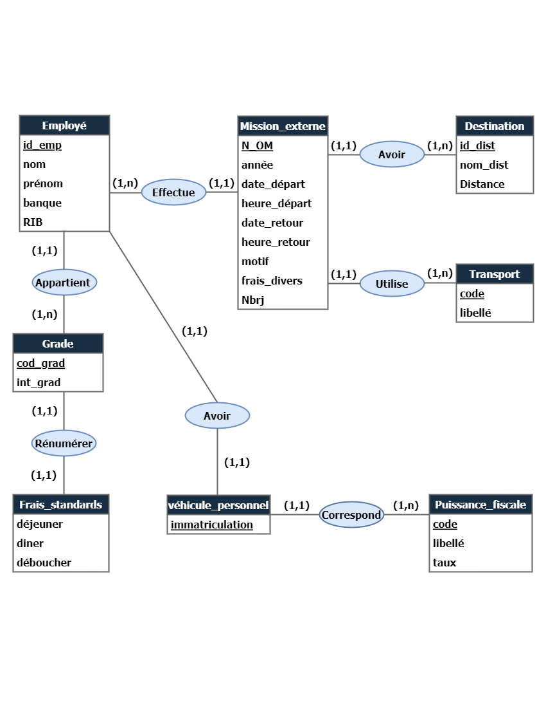
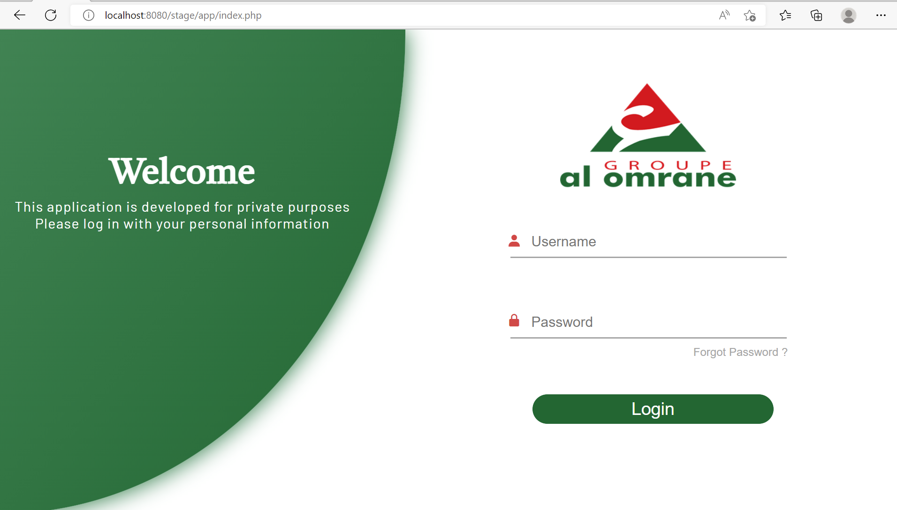
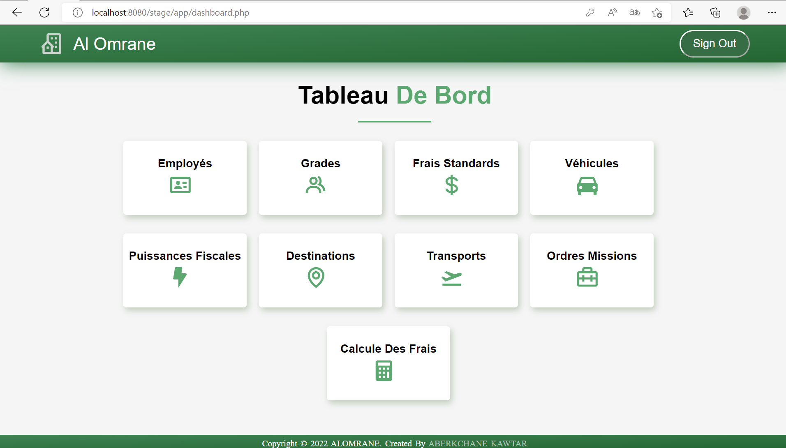
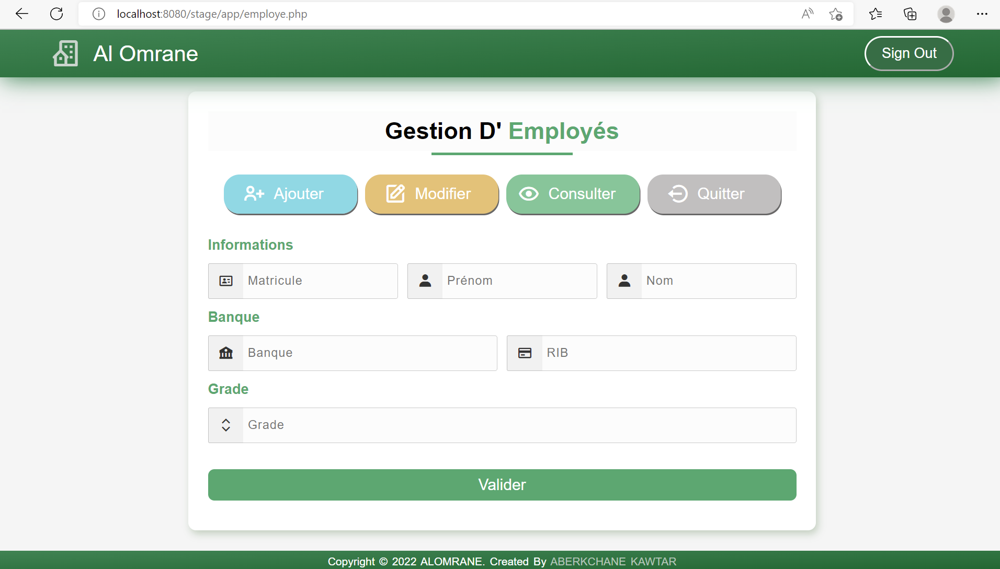
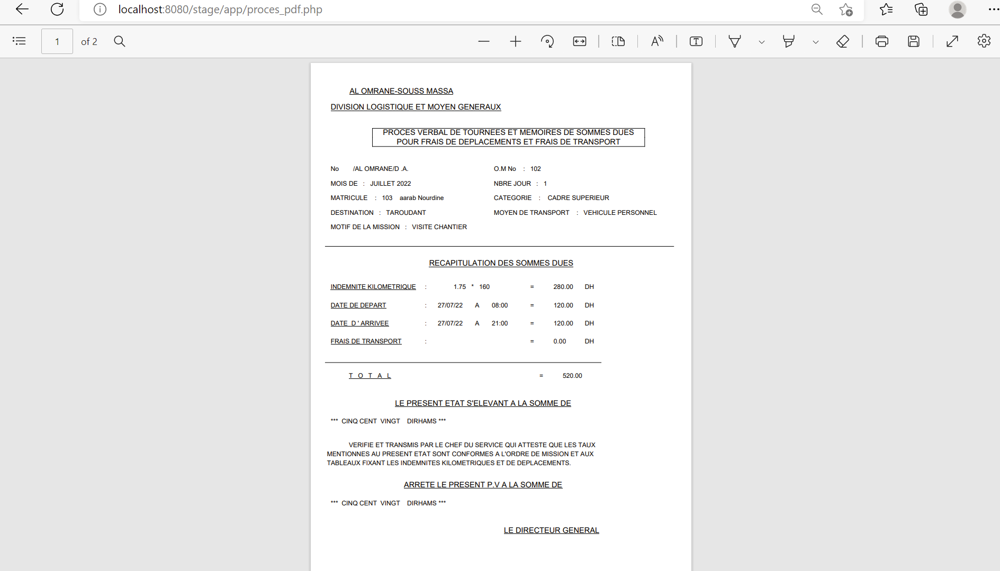

# stuff-traveling-management
The project aims to revolutionize the management of travel expenses at Al Omrane company by introducing a process digitization application. Currently, the tedious and error-prone manual task of handling travel data will be transformed into an automated and efficient process. The proposed application will facilitate the input, modification, and retrieval of information related to employee travel, allowing for streamlined and rapid management.

## Table of Contents
* [General Information](#general-information)
* [Technologies Used](#technologies-used)
* [Features](#features)
* [Setup](#setup)
* [Usage](#usage)
* [Screenshots](#screenshots)


## General Information
### Main Features
- Data Management (employees, mission, grades, transportation, horsepower, destinations...).
- Total Expense Calculation to be remunerated.
- Administrative Document Generation.


### File structure
The file structure of the project is the following:
```
├── app (contains the code php+html)   
├── css (contains the styling)
├── fpdf (library to generate pdfs)
├── images
├── js (code javascript)
└── README.md
```


## Technologies Used
* PHP
* HTML
* CSS
* JS
* AJAX
* FPDF
* MYSQL


## Setup
### Pre-Requisites
To set up this project you should install the following:
- XAMPP (apache, mysql)
- VSCODE (or any other IDE)
- FPDF
  * First download the composer from this [Link_1](https://getcomposer.org/)
  * Second install the zip from [Link_2](http://www.fpdf.org/)

### Usage
To use the project you should do the following:
- Add the project to **'htdocs'** folder on the xampp environment.
- Create the database on phpmyadmin panel.


## Screenshots
### Home Page


### Dashboard 


### Data Management


### Document generation (after calculation)

